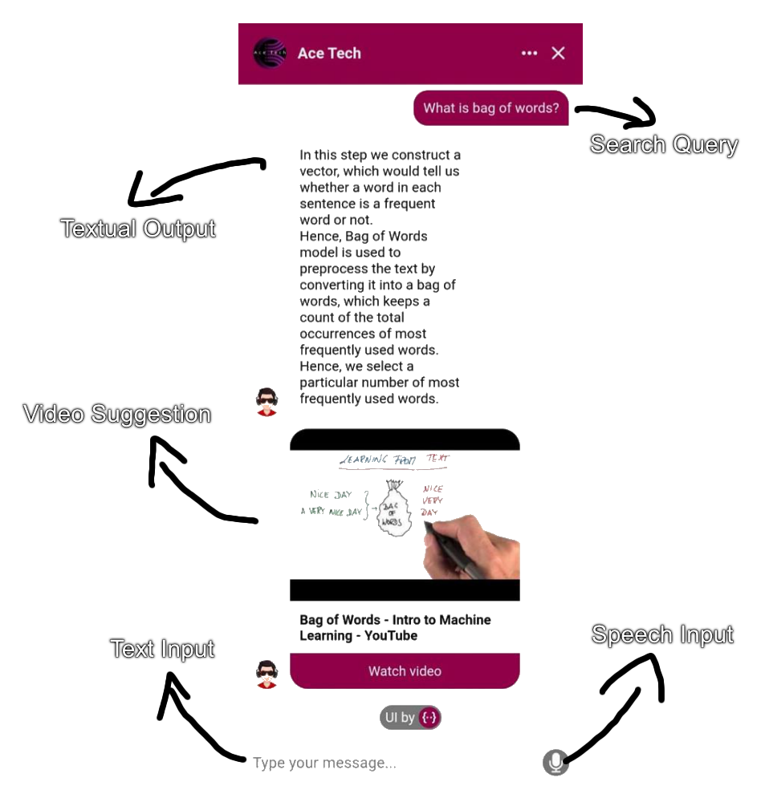
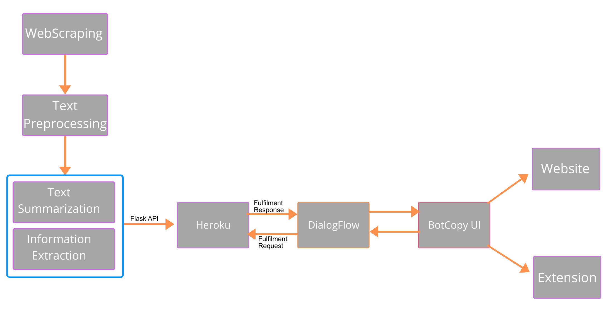

# Ace-Tech
AceTech is a chat bot used as web extension to serve tech and programming queries with concise answers up to 100 words and video/articles cards. It is implemented in Python and Dialogflow with real time web scraping and applying NLP techniques for query based extractive summarization, deployed in Heroku using Flask API.

  

# Workflow

  

